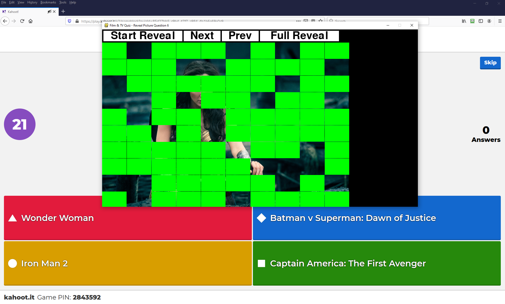

# KahootFilmQuiz
Gradual reveal of a film still - players can complete on Kahoot to name it first

### Using it
* Create an account on Kahoot
  * Create a quiz with a load of questions (all will be "What film is this?" and 4 possible answers
  * Host quiz on zoom with screen share
  * Use this App to do the actual reveal
  
  

### Prerequisites

You need python and these 2 pip (conda packages)
* pygame  
    * https://pypi.org/project/pygame/
* python dateutil 
  * https://pypi.org/project/python-dateutil/
  * note package name is not just 'dateutil' it is 'python dateutil'

## Acknowledgments

* This tutorial was used as a starting point
  * https://inventwithpython.com/pygame/chapter3.html
